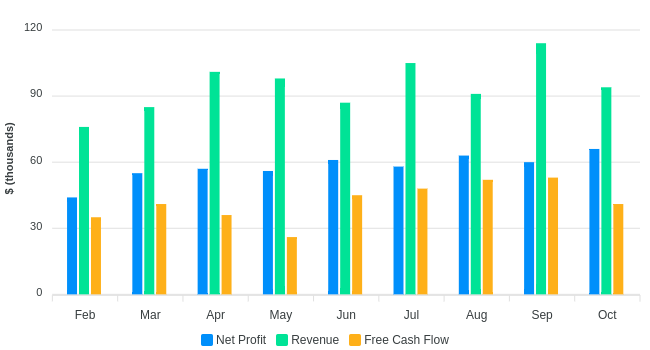
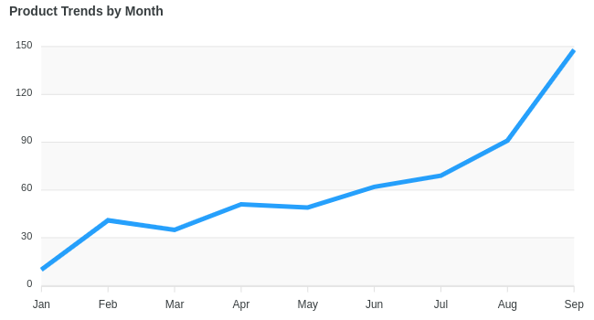
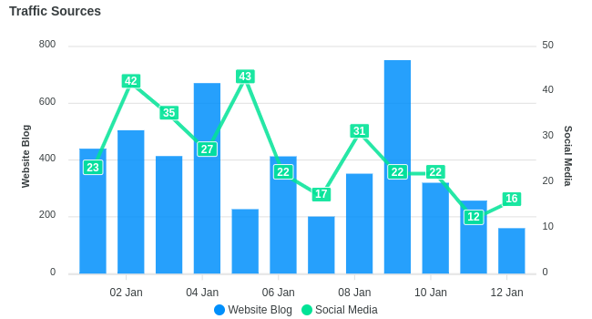
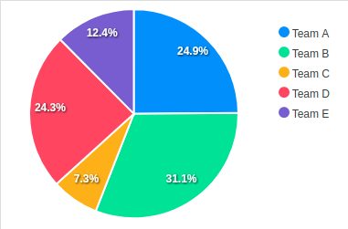
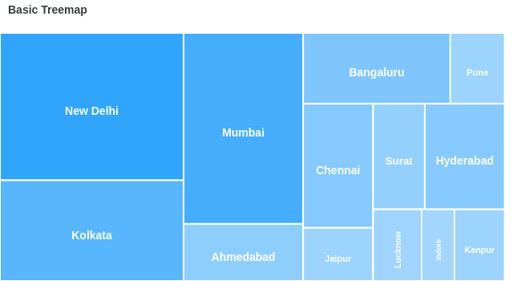
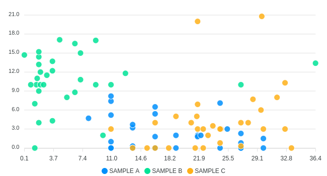
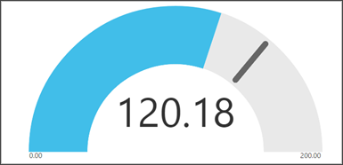

# Data Visualization 🎲

<!-- TOC -->

- [Data Visualization](#data-visualization)
  - [Dashboard vs Infográficos](#dashboard-vs-infográficos)
  - [Correlação e Causalidade](#correlação-e-causalidade)
  - [Storytelling](#storytelling)
  - [Design](#design)
  - [Tipos de Gráficos](#tipos-de-gráficos)

<!-- /TOC -->

# Dashboard vs Infográficos

## Infográfico

Infográficos possuem menos dados e são mais conclusivos. São dados fixos, estáticos (podem ser criados usando Adobe Illustrator ou Canva).

## Dashboard

Diferentemente de Infográficos, Dashboards não são estáticos, pois se atualizam de forma constante.

- Foco em indicadores de performance.
- Informações mais sumarizadas.

O objetivo de um dashboard é trazer alertas para quem utilizá-lo. É mais fácil enxergar tendências nos dados, pontos fora da curva e padrões. Coisas não comumente notadas ao se olhar tabelas ou planilhas.

Ferramentas para criação de dashboards e visualização de dados:

- QLIK
- TABLEAU
- POWERBI

A utilização de dashboards é realizada em busca de insights (enxergar algo de forma intuitiva).

# Correlação e Causalidade

## Correlação

Medida estatística. Mensuração de quanto as coisas andam juntas ou separadas.

- Se dois indicadores estão subindo então a correlação é positiva.
- Se dois indicadores estão descendo então a correlação também é positiva.
- Se um indicador está indo para cima e o outro para baixo então a correlação é negativa.
- Se ambos indicadores não se alteraram então a correlação é neutra.

Primeiro Exemplo: a medida que uma criança vai ficando mais velha ela também fica mais alta, existe uma correlação entre tempo e altura. Observação: um não é causa do outro, a criança não fica mais alta porque ela tem mais idade.

Segundo Exemplo: tempo de estudo e nota em prova. Quanto mais se estuda mais alta é a nota, correlação positiva. Porém não necessariamente existe uma situação de causalidade em todos os casos, pois é possível tirar uma nota boa sem ter estudado.

## Causalidade

**Toda causalidade implica uma correlação, mas nem toda correlação implica uma causalidade.**

É necessário realizar um estudo específico que, efetivamente, faça uma relação entre um efeito a partir de uma causa e isso não necessariamente é sempre verdade.

> Exemplos de casos de correlações sem causalidade: [Spurios Correlations](http://tylervigen.com/spurious-correlations)

# Storytelling

## Narrativa + Data

**EXPLICAR**. O que está acontecendo com os dados e porque um insight é importante. Em geral tabelas.

## Visualizar + Data

**"ILUMINAR"**. Traz "a luz" sobre insights que normalmente não seriam vistos sem gráficos. Padrões e pontos fora da curva.

## Visualizar + Narrativa

**ENGAJAR**. "Prende" a audiência, ativa o emocional.

Por que o Storytelling é importante? Porque melhora muito a capacidade de transmitir uma mensagem e, a partir disso, influenciar uma mudança.

> Credibilidade. Trabalhando com visualização de dados, deve-se ter uma preocupação excepcional, excessiva com a questão da qualidade e da precisão do que se apresentar.

# Design

## Contexto

Contexto é fundamental. Deve-se deixar claro o contexto da situação ou em que os dados estão inseridos para se visualizar melhor suas aplicações.

Ele te dá uma informação do em torno do que está sendo explicado e posiciona melhor a audiência sobre o assunto. Contexto ajuda a se passar a imagem mais correta.

## Data-Ink

Da visualização de dados, quanto dela é, efetivamente, relacionado aos dados? Data-Ink é a parte da visualização que está relacionada aos dados, Non-Data-Ink seria o resto. **Deve-se deixar a visualização o máximo possível do que esteja relacionado com dados e evitar o Non-Data-Ink.**

```
Data-Ink Ratio = Data-Ink / Non-Data-Ink
```

## Visualização de dados 🎲 _Menos é mais._

Evitar Chart Junk. Deixar os gráficos o mais simples possível com o que realmente interessa.

> "Ter insights e fazer descobertas numa visualização entupida é como procurar uma agulho num palheiro."

Princípio "RAG":

- 🔴 RED - Negativo
- 🟡 AMBAR - Alert
- 🟢 GREEN - Positivo

Precisão deve ser entregue de acordo com quem está assistindo.

:warning: NÃO UTILIZAR GRÁFICOS EM 3D! Não há nenhuma justificativa para utilização de gráficos 3D.

Elementos de visualização devem estar com alinhamentos corretos para melhor e mais rápido entendimento dos dados.

:warning: Ter cuidados com animações.

Contraste pode **entregar uma mensagem** específica, além de proporcionar **atenção num ponto específico**.

# Tipos de Gráficos

## Gráfico de barras (seu melhor amigo)



- Resolve seu problema em 80% dos casos.

## Gráfico de linhas



Dois cuidados:

- Sempre utilizar grid para dar referência e contexto
- Não exagerar no número de linhas

## Combos



- São ótimos para mostrar mais de uma dimensão ao mesmo tempo. Funcionam bem tanto com categorias como com séries temporais.
- Possível juntar diferentes tipos de gráficos(colunas e marcadores, colunas e linhas...).
- Assim como gráficos de barra e de linhas, fica complicado ler mais que três dimensões.

## Histograma circular - Gráficos de torta



- Deve-se saber utilizar. Melhor evitar.
- Precisa ter poucos elementos.

## Gráficos de árvore - Trees Maps



- Apesar do nosso cérebro ser péssimo para comparar áreas, "tree maps" são excelentes para dar contexto.
- Explicar: não sei quanto é a área A, mas sei que é maior que o dobro da área B
- Poder ser usado como gráfico auxiliar.
- User com cuidado, mas mantenha-o no seu arsenal.

## Gráficos de dispersão - Scatter Plot



- Não é comum, mas é uma ferramente poderosa se usado no lugar e na hora certa.
- Excelent para storytellings de séries temporais (mudanças das relações XY em função do tempo).
- [gapminder.org](gapminder.org) (sw e bases)
- Pode-se também utilizar o tamanho do ponto como dimensão e cor

## Medidores - Gauges



- Excelentes para kpi's - "entregam" a mensagem instantaneamente.
- No entanto, devem ser usados como gráficos auxiliares, pois:
  - São pouco precisos
  - Não tem info analítica, não servem para analisar

> Gráficos retirados de [Apex Charts](https://apexcharts.com/javascript-chart-demos/)
